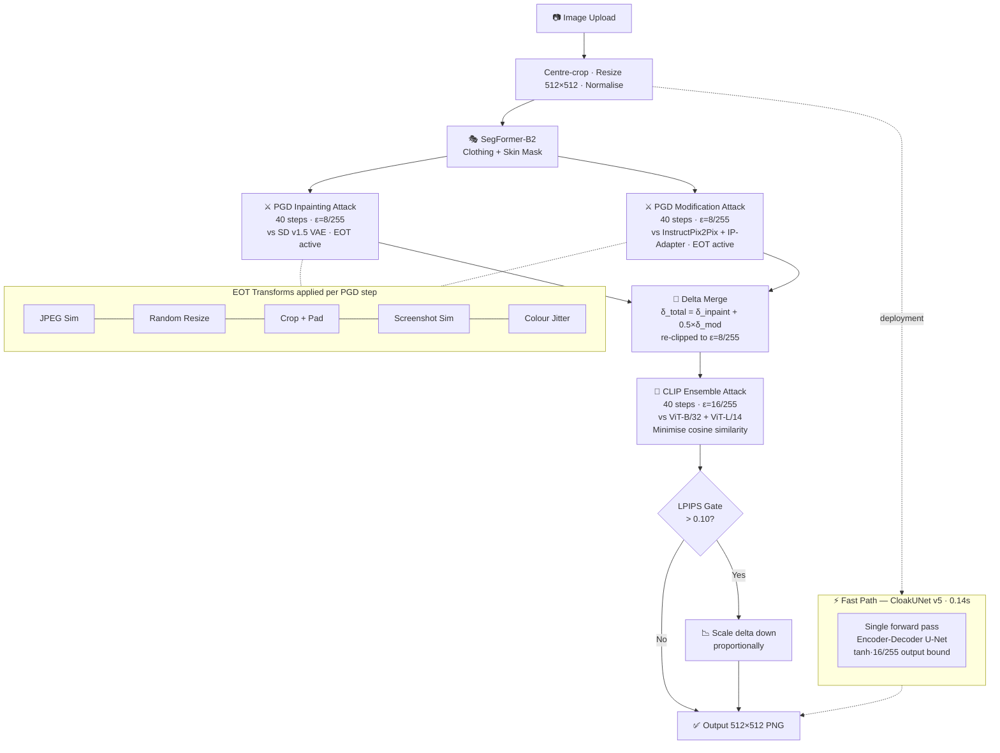

<div align="center">

```
██╗     ██╗   ██╗██╗  ██╗███████╗
██║     ██║   ██║╚██╗██╔╝██╔════╝
██║     ██║   ██║ ╚███╔╝ █████╗  
██║     ██║   ██║ ██╔██╗ ██╔══╝  
███████╗╚██████╔╝██╔╝ ██╗███████╗
╚══════╝ ╚═════╝ ╚═╝  ╚═╝╚══════╝
```

### *Your Photos. Your Rules.*

**Adversarial Image Protection** — Anti-Nudification & Anti-Modification via Imperceptible Perturbation


[](https://luxe-dlp.vercel.app)
[](https://rameenzehra-luxe-backend.hf.space)

*Deep Learning for Perceptron — May 2026*  
Nabira Khan [23k-0914] · Rameen Zehra [23k-0501] · Aisha Asif [23k-0915]

</div>

---

Luxe embeds imperceptible adversarial perturbations into personal photographs to defeat AI-based nudification and outfit-modification attacks. It jointly attacks inpainting nudification pipelines (SD v1.5/v2/SDXL) and instruction-following modification models (InstructPix2Pix, IP-Adapter) within a unified PGD framework augmented by Expectation over Transformations (EOT) and a dual-model CLIP ensemble second pass.

The primary novel contribution is **CloakUNet** — a trained encoder-decoder U-Net that distils the full PGD pipeline into a single feedforward pass, achieving **0.14s inference** vs ~90s for standard PGD (**630× speedup**).

---

## Architecture



---

## Results

<div align="center">

| Metric | Achieved | Target | Status |
|:-------|:--------:|:------:|:------:|
| Visual Quality — LPIPS | `0.077` | < 0.10 | ✅ PASS |
| Visual Quality — PSNR | `37.2 dB` | > 35 dB | ✅ PASS |
| Visual Quality — SSIM | `0.941` | > 0.95 | ⚠️ PARTIAL |
| CLIP Semantic Disruption | `0.234` | < 0.50 | ✅ PASS |
| CloakUNet Inference Speed | **`0.14s`** | < 1.0s | ✅ PASS |
| SD v1.5 White-box Disruption | `0.164` | — | — |
| SD v2 Grey-box Disruption | `0.177` | — | — |
| SDXL Grey-box Disruption | `0.125` | — | — |
| CloakUNet Val Latent Distance | `80.0` | > 80 | ✅ PASS |
| Full PGD Latent Distance | `46.7` | > 10 | ✅ PASS |

</div>

> CLIP cosine similarity reduced from **0.767** (no CLIP attack) → **0.234** (full system). CloakUNet is **630×** faster than full PGD on the same T4 GPU hardware.

---

## EOT Robustness

| Transform | LPIPS After | vs Baseline | Status |
|-----------|:-----------:|:-----------:|:------:|
| Random Resize | 0.072 | 0.93× | ✅ GOOD |
| Colour Jitter | 0.084 | 1.09× | ✅ GOOD |
| JPEG Compression | 0.141 | 1.83× | ⚠️ PARTIAL |
| Crop + Pad | 0.335 | 4.35× | ❌ DEGRADED |
| Screenshot Sim | 0.442 | 5.74× | ❌ DEGRADED |

---

## Models

| Checkpoint | Size | Description |
|------------|:----:|-------------|
| `segformer_lip.pth` | ~105 MB | SegFormer-B2 fine-tuned on LIP — 20-class body-part segmentation |
| `cloak_unet.pth` | ~15 MB | CloakUNet v5 — encoder-decoder U-Net, 3 downsample stages, 512-ch bottleneck |
| `sd_inpaint_vae.pth` | ~320 MB | Fine-tuned SD v1.5 Inpainting VAE (nudification surrogate) |
| `ipp_vae.pth` | ~320 MB | IPP VAE (modification surrogate) |
| `ip_adapter.pth` | ~1.6 MB | IP-Adapter projection (outfit-swap guard) |

Checkpoints download automatically at startup from Google Drive via `backend/download_checkpoints.py`.

---

## Stack

| Layer | Technology | Host |
|-------|------------|------|
| Frontend | React 18 · Vite · Three.js · Framer Motion · Tailwind | [Vercel](https://luxe-dlp.vercel.app) |
| Backend API | Python 3.10 · FastAPI · Uvicorn | [Hugging Face Spaces](https://rameenzehra-luxe-backend.hf.space) |
| Adversarial engine | PyTorch 2.x · PGD · EOT | Backend |
| Segmentation | SegFormer-B2 (fine-tuned LIP) | Backend |
| Nudification surrogate | SD v1.5 Inpainting VAE (fine-tuned) | Backend |
| Modification surrogate | InstructPix2Pix + IP-Adapter | Backend |
| Fast path | CloakUNet v5 | Backend |
| CLIP attack | ViT-B/32 + ViT-L/14 ensemble | Backend |
| Training compute | Kaggle T4 GPU · 15.6 GB VRAM | — |

---

## Local Development

### Backend

```bash
cd backend
pip install -r requirements.txt
uvicorn main:app --reload
```

Health: `http://localhost:8000/health` — all 5 checkpoints should show `true`.

### Frontend

```bash
cd frontend
npm install
cp .env.example .env.local    # set VITE_API_URL=http://localhost:8000
npm run dev
```

---

## Deployment

### Backend → Hugging Face Spaces

Live at: **https://rameenzehra-luxe-backend.hf.space**

1. Create a Space (Docker SDK) under the `rameenzehra` account
2. Push the `backend/` directory — the `Dockerfile` is already configured
3. Set Space secrets:
   ```
   CORS_ORIGIN = https://luxe-dlp.vercel.app
   ```
4. Checkpoints download automatically on first boot via `download_checkpoints.py`
5. Verify `/health` returns all 5 checkpoints `true`

> HF Spaces free tier provides enough RAM for SegFormer + CloakUNet. Cold starts may take ~30s.

### Frontend → Vercel

Live at: **https://luxe-dlp.vercel.app**

1. **New Project** → import this repo, root directory `frontend/`
2. Add environment variable:
   ```
   VITE_API_URL = https://rameenzehra-luxe-backend.hf.space
   ```
3. Deploy — Vercel detects Vite automatically

---

## API Reference

### `GET /health`

```json
{
  "status": "ok",
  "checkpoints": {
    "segformer_lip": true,
    "cloak_unet": true,
    "sd_inpaint_vae": true,
    "ipp_vae": true,
    "ip_adapter": true
  }
}
```

### `POST /protect`

| Field | Type | Values |
|-------|------|--------|
| `file` | image — JPEG / PNG / WEBP · max 10 MB | — |
| `mode` | string | `nudify` · `modify` · `full` |
| `texture` | bool | `true` / `false` |

**Response:** `image/png` · 512×512  
**Headers:** `X-Checkpoint-Status` (`UNET_OK` / `UNET_MISSING`) · `X-Processing-Path` (`unet` / `pgd`)

---

## References

| | |
|-|-|
| [PhotoGuard] | Salman et al. (2023). *Raising the Cost of Malicious AI-Powered Image Editing.* arXiv:2302.06588 |
| [EOT] | Athalye et al. (2018). *Synthesizing Robust Adversarial Examples.* ICML 2018 |
| [Glaze] | Shan et al. (2023). *Glaze: Protecting Artists from Style Mimicry.* USENIX Security 2023 |
| [PGD] | Madry et al. (2018). *Towards Deep Learning Models Resistant to Adversarial Attacks.* ICLR 2018 |
| [CLIP] | Radford et al. (2021). *Learning Transferable Visual Models From Natural Language Supervision.* ICML 2021 |
| [SegFormer] | Xie et al. (2021). *SegFormer: Simple and Efficient Design for Semantic Segmentation.* NeurIPS 2021 |
| [SD] | Rombach et al. (2022). *High-Resolution Image Synthesis with Latent Diffusion Models.* CVPR 2022 |
| [IPP] | Brooks et al. (2023). *InstructPix2Pix: Learning to Follow Image Editing Instructions.* CVPR 2023 |
| [IP-Adapter] | Ye et al. (2023). *IP-Adapter: Text Compatible Image Prompt Adapter.* arXiv:2308.06721 |
| [DeepFashion] | Liu et al. (2016). *DeepFashion: Powering Robust Clothes Recognition.* CVPR 2016 |
| [LIP] | Gong et al. (2017). *Look into Person: Self-supervised Structure-sensitive Learning.* CVPR 2017 |

---

<div align="center">
<sub>© 2026 Luxe — Deep Learning for Perceptron</sub>
</div>
